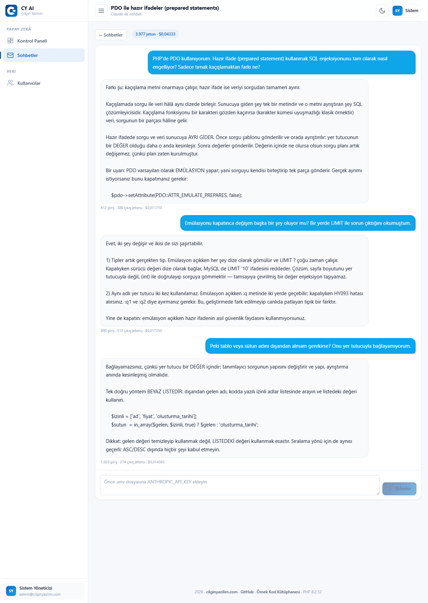
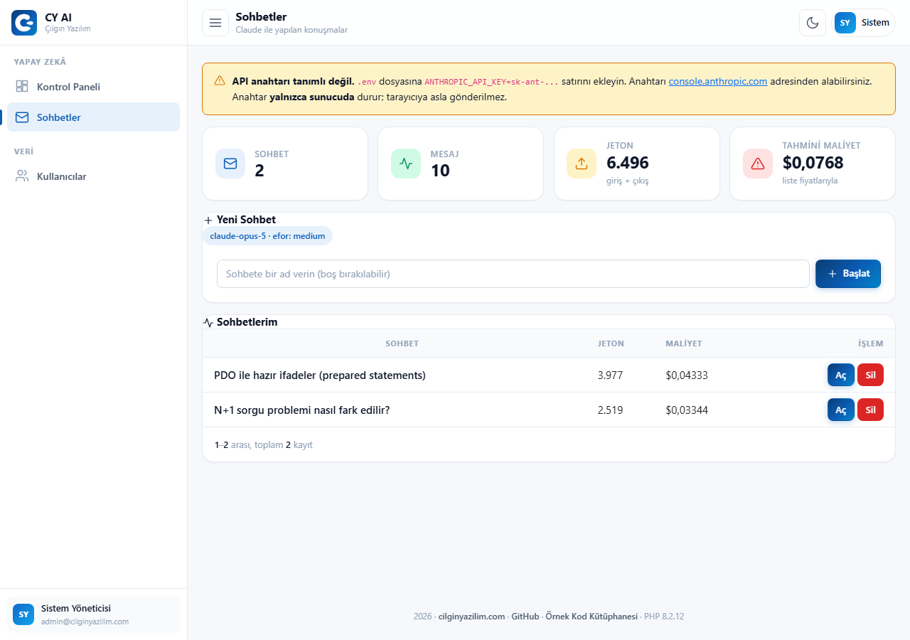
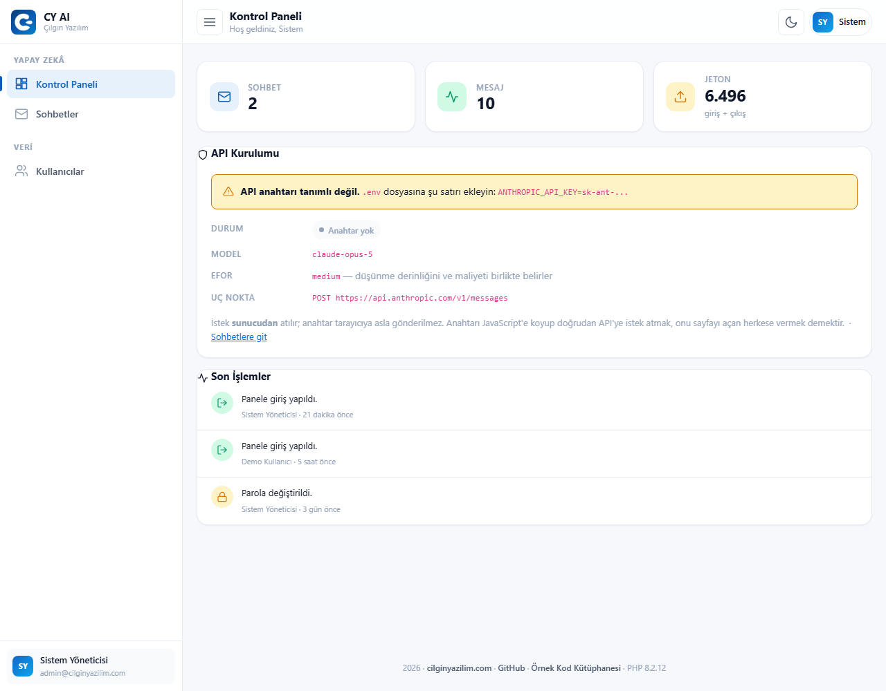
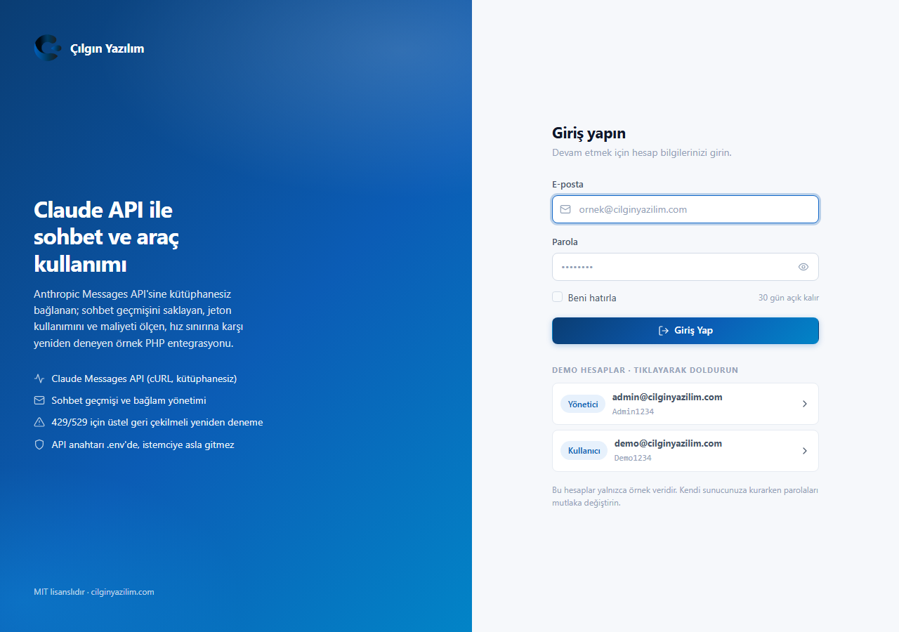
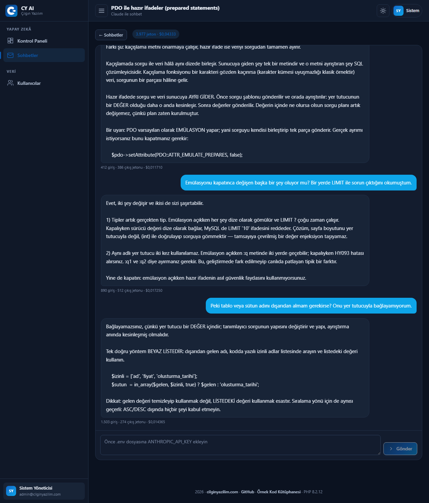
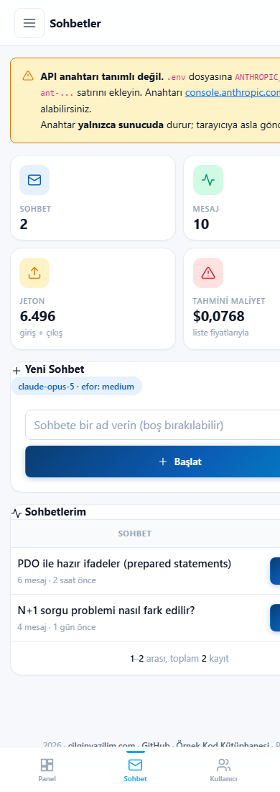

<div align="center">


# AI Integration (Claude API)

### PHP 8 · PDO · MySQL · Claude Messages API · Token and Cost Tracking · Thinking Summaries · Çılgın Yazılım Design Pattern

**The key stays on the server, every response's cost is calculated, and the conversation history lives in the database.**

[](https://php.net)
[](https://mysql.com)
[](https://docs.anthropic.com)
[](#installation)
[](LICENSE)

[🇹🇷 Türkçe](README.md) · **🇬🇧 English**

[**▶ Live Demo**](https://cilginyazilim.com/kutuphane/uygulama/ai-integration-system/) · [Code Library](https://cilginyazilim.com/kutuphane/php-ai-integration) · [cilginyazilim.com](https://cilginyazilim.com)

</div>

---

<div align="center">

## Live Demo

**No setup, no sign-up, no download — try it in your browser in 3 seconds.**

<a href="https://cilginyazilim.com/kutuphane/uygulama/ai-integration-system/"></a>
<a href="https://cilginyazilim.com/kutuphane/php-ai-integration"></a>
<a href="https://github.com/CilginYazilim/ai-integration-system/archive/refs/heads/main.zip"></a>

<br><br>

<a href="https://cilginyazilim.com/kutuphane/uygulama/ai-integration-system/" title="Click to open the live demo">
  
</a>

<sub>▲ Click the image to open the demo</sub>

</div>

<br>

### Demo accounts

| Role | E-mail | Password |
|---|---|---|
| Administrator | `admin@cilginyazilim.com` | `Admin1234` |
| User | `demo@cilginyazilim.com` | `Demo1234` |

### What can you try in 60 seconds?

| # | Try this | What happens behind the scenes |
|---|---|---|
| **1** | Open the **Conversations** page and look at the four counters | Conversations · messages · total tokens · **estimated cost**. The cost is computed from the model's price table; it isn't a fixed number |
| **2** | **Open** the "PDO and prepared statements" conversation | Three question-answer pairs. User messages sit right in blue, replies on the left; code samples keep their indentation |
| **3** | Look at the **token line** below each reply | `412 in · 386 out tokens · $0.011710`. That figure isn't made up: `in/1M × $5 + out/1M × $25` |
| **4** | Watch the **input tokens grow** through the conversation: 412 → 890 → 1,503 | The model is stateless; the **entire** conversation is resent on every request. That is exactly why long conversations get expensive |
| **5** | Look at the badge in the conversation header: `3,977 tokens · $0.04333` | The conversation total matches the sum of the messages **exactly**. The page never contradicts itself |
| **6** | Open "How do you spot an N+1 query?" and press **"show thinking summary"** | The model's reasoning before it composed the answer. It opens with `<details>` — no JavaScript needed |
| **7** | Look at the **API Setup** card on the dashboard | Whether the key is configured, the model, the effort level and the endpoint — at a glance |
| **8** | Read the "Requests are made **from the server**" note on the same card | The key is **never** sent to the browser. Putting it in JavaScript and calling the API directly hands it to everyone who opens the page |
| **9** | Press **Delete** on a conversation | Messages go with it via `ON DELETE CASCADE`; no orphan rows remain. You can only delete **your own** conversations |
| **10** | Open it on your phone | Bubbles widen, counters stack vertically; there is **no horizontal scrolling** on the page body |

> **There is no API key on the demo** — so no new responses can be generated. The three conversations on screen are **hand-written** examples meant to show the interface fully populated; the token and cost figures were computed with the real price table. Add your own key to `.env` and real responses start flowing.

### What to know about the demo area

| Topic | Status |
|---|---|
| **Data** | **51 users + 3 sample conversations + 14 messages** from `database.sql`. No real personal data. |
| **API key** | **Not present** on the demo. Sending is disabled; existing conversations are readable. |
| **Sample conversations** | Not real API calls — hand-written examples. The token and cost figures are **consistent** with the price table. |
| **Reset** | The demo database is **periodically restored** to its initial state. |
| **`APP_DEBUG`** | Automatically **`false`** in production — derived from the host name. |
| **Dependencies** | **Zero.** No SDK, no Composer, no npm, no CDN. Requests are made with `cURL`. |

---

## What Is This Project?

Wiring an AI API into a project looks like a single `curl` call. In reality four questions follow immediately, and all four get expensive if you take them lightly:

- **Where will the key live?** Put it in JavaScript and everyone who opens the page can see it and spend on your account.
- **How much did I spend this month?** The bill arrives at month's end; until then you have no idea.
- **Why is the second question pricier than the first?** Because the model is stateless: the entire conversation is resent — and **re-billed** — on every request.
- **What happens when the API errors?** `429` and `529` are transient and should be retried; `401` is permanent and retrying is pointless. Code that doesn't tell them apart either wastes time or gives up too early.

This project builds an integration layer that handles all four. The key lives in `.env` and is used **only on the server**. Every response's input/output tokens and **computed cost** are recorded. The conversation history is in the database. Error handling separates transient from permanent and retries the transient ones with **exponential backoff**.

The model's "thinking" summary is stored too and can be expanded in the UI — seeing how an answer was constructed is the most practical way to judge it.

The `ClaudeClient` class uses no SDK; the request is made with `cURL` and the response parsed by hand.

**Who is it for?**

- Anyone adding an AI feature to their project who wants to keep costs under control
- Anyone asking where to put an API key
- Anyone who wants to learn how token accounting is done
- Anyone who wants to reach the Messages API in plain PHP, without installing an SDK
- Anyone looking for a reusable admin panel pattern built on Bootstrap 5

This project is one of the documented, production-ready examples published in the **[Çılgın Yazılım Code Library](https://cilginyazilim.com/kutuphane)**.

---

## Table of Contents

- [Live Demo](#live-demo)
- [What Is This Project?](#what-is-this-project)
- [Screenshots](#screenshots)
- [The journey of a request](#the-journey-of-a-request)
- [Key Decisions](#key-decisions)
- [What's Included?](#whats-included)
- [How is the cost calculated?](#how-is-the-cost-calculated)
- [Error handling](#error-handling)
- [Security: What Did We Close, and How?](#security-what-did-we-close-and-how)
- [Installation](#installation)
- [Configuration](#configuration)
- [File Structure](#file-structure)
- [Database Schema](#database-schema)
- [FAQ](#faq)
- [Going to Production](#going-to-production)
- [Troubleshooting](#troubleshooting)
- [Roadmap](#roadmap)
- [Contributing](#contributing)
- [License](#license)

---

## Screenshots

### Conversations

The four counters are the token accounting in miniature: conversations · messages · total tokens · **estimated cost**. Cost is not a fixed number; it is computed from the model price table (`input/1M × $5 + output/1M × $25`). Every row carries its own token and cost badge.



### Conversation detail

User messages on the right, replies on the left; code samples keep their indentation. The line under each reply gives that message's input/output tokens and cost. The message-by-message growth of input tokens (412 → 890 → 1,503) is visible here: the model is stateless, so **the entire** conversation is resent — and recharged — on every request. The thinking summary opens in a `<details>` element, no JavaScript required.


### Dashboard

The **API setup** card shows at a glance whether the key is defined, plus the model, effort level and endpoint. The note below it says the request is made **from the server**: the key is never sent to the browser.



### Login screen

Demo accounts fill in with one click. Login attempts are rate limited; after repeated failures the account is temporarily locked.



### Dark theme

The theme is stored in the **user account**, not the browser, so it follows you to another device. Chat bubble background and text colors are measured separately for dark mode.



### Mobile view

At 390px the bubbles widen, the counters stack and bottom navigation takes over. The page body never scrolls horizontally.



---

## The journey of a request

```
 BROWSER                           SERVER (PHP)                    ANTHROPIC API
 ───────                           ────────────                    ─────────────
 The user types a message
    │  POST /api/chat/send
    │  (with a CSRF token)
    ▼
                          a "user" row in ai_messages
                                   │
                                   │  ClaudeClient::send()
                                   │
                                   │  1) Collect the ENTIRE conversation
                                   │     (the model is stateless)
                                   │
                                   │  2) x-api-key: <KEY>       ◄── THE KEY
                                   │     anthropic-version: ...      STAYS HERE
                                   │                                 it never
                                   │  3) POST /v1/messages ──────────► reaches
                                   │                                  the browser
                                   │                                     │
                                   │                                     ▼
                                   │  ◄────────────────────── 200 / 429 / 529 / 4xx
                                   │
                                   │  4) 429 · 529 · 5xx  → TRANSIENT
                                   │     exponential backoff + jitter
                                   │     retry up to 3 times
                                   │
                                   │     401 · 400        → PERMANENT
                                   │     stop retrying, explain
                                   │
                                   │  5) Parse the response:
                                   │     text · thinking · stop_reason
                                   │     refusal · usage
                                   │
                                   │  6) COMPUTE THE COST
                                   │     in/1M×$5 + out/1M×$25
                                   ▼
                          an "assistant" row in ai_messages
                          (text · thinking · tokens · cost)
                                   │
                          ai_conversations totals are updated
                                   │
    ◄──────────────────────── JSON response
    ▼
 The bubble is drawn, the token line printed
```

---

## Key Decisions

### 1. The API key **never** reaches the browser

A surprising share of examples on the internet put the key in JavaScript and call the API directly with `fetch`. That is **handing the key to everyone who opens the page**: `F12 → Sources` is enough. Others spend with your key; you pay the bill.

In this project the request is always made **from the server**:

```
Browser → (your own server) → Anthropic API
```

The key lives in `.env`, is listed in `.gitignore`, and never leaves PHP. The browser only talks to your own server — through a CSRF-protected endpoint that requires a session.

### 2. Every message's tokens and cost are **recorded**

The bill arrives at month's end. If you don't know which feature spent what until then, you cannot manage cost.

```sql
ai_messages: input_tokens · output_tokens · cost_usd
ai_conversations: total_tokens · total_cost
```

The numbers come from the API's `usage` field — a measurement, not an estimate. The cost is computed from the price table.

The conversation total **equals** the sum of the messages; a number kept in two places that disagree is an untrustworthy indicator.

### 3. Why do input tokens grow with every message?

Because **the model is stateless**. There is no "remember my previous message"; you resend the entire conversation on every request, and the entire thing is re-billed.

The sample conversation makes this concrete: `412 → 890 → 1,503`. The third question consumes four times the input tokens of the first — even if the question is the same length.

That explains why long conversations get expensive. The practical consequence: don't send unlimited history. Summarising older messages and sending the summary is a common and effective pattern.

### 4. Transient errors are separated from permanent ones

```php
$retryable = $status === 429 || $status === 529 || $status >= 500;
```

| Code | Meaning | What happens |
|---|---|---|
| `429` | Rate limit | **Transient** — retry with backoff |
| `529` | Service overloaded | **Transient** — retry |
| `5xx` | Server error | **Transient** — retry |
| `401` | Invalid key | **Permanent** — retrying is pointless |
| `400` | Malformed request | **Permanent** — the request must be fixed |

Code that doesn't distinguish loses both ways: it retries `401` three times and wastes time, and it never retries `429` and shows the user a needless error.

Retries use **exponential backoff + jitter**. The jitter (random offset) matters: if a hundred clients hit the limit at the same moment and all retry at the same moment, they hit it together again.

### 5. `stop_reason` and `refusal` are not ignored

A response can come back "successful" but **incomplete**:

- `stop_reason = "max_tokens"` → the answer was cut mid-sentence. Showing a truncated text as if it were complete is wrong.
- `refusal` set → the model deliberately declined. That is not an error and must not be presented as "server error".

Both are handled separately and displayed differently in the UI.

That's why `AI_MAX_TOKENS` defaults to **16,000**. Keeping it low looks like a saving, but you end up re-asking for a truncated answer — paying twice.

### 6. The "thinking" summary is stored, but shown collapsed

The model's reasoning is the most practical way to evaluate its output: if the answer is wrong, you can see where it went astray.

But it doesn't need to be on screen all the time; a `<details>` element folds it away. No JavaScript, and accessibility works out of the box.

### 7. Text is printed with `pre-wrap`, not `nl2br()`

Model responses contain code samples, and code **indentation** carries meaning.

```css
.cy-msg__bubble { white-space: pre-wrap; }
```

`pre-wrap` preserves both line breaks and indentation while still wrapping long lines. Adding `nl2br()` on top applies every line break **twice** and doubles the paragraph gaps — code-heavy answers fall apart on screen.

> For the same reason there is **no whitespace** between the bubble's `<div>` and its content: `pre-wrap` counts the template's own indentation as text, and every bubble's first line would appear shifted to the right.

### 8. Deleting a conversation deletes its messages

```sql
CONSTRAINT fk_msg_conv FOREIGN KEY (conversation_id)
    REFERENCES ai_conversations (id) ON DELETE CASCADE
```

Had the application code said "delete the messages first, then the conversation", an error between those two steps would leave orphaned messages. Putting the constraint in the database makes that **impossible**.

---

## What's Included?

<table>
<tr><td valign="top" width="50%">

**API layer**

- Requests to the Messages API via `cURL` — **no SDK**
- The key stays server-side only
- Exponential backoff + jitter, up to 3 attempts
- Transient (`429`/`529`/`5xx`) vs. permanent error separation
- `stop_reason` and `refusal` handled separately
- Model and effort level from `.env`
- Configurable `max_tokens`

**Accounting**

- Input/output tokens per message
- Cost per message (from the price table)
- Total tokens and cost per conversation
- Four counters in the panel

</td><td valign="top" width="50%">

**Chat interface**

- Conversation list with token and cost columns
- User/model bubbles that preserve code indentation
- A collapsible "thinking summary" (`<details>`)
- A token and cost line under each message
- Conversation deletion (own conversations only)
- A clear warning when the key is missing

**Shared infrastructure**

- Session login, "remember me", rate limiting, CSRF
- CSP (`script-src 'self'`), `X-Frame-Options: DENY`
- Light / dark theme, stored on the account
- Bottom navigation on mobile, no horizontal scrolling
- Live filtering on the users page (works without JS too)

</td></tr>
</table>

---

## How is the cost calculated?

Prices are per million tokens and live in the `ClaudeClient::PRICING` table:

| Model | Input (1M tokens) | Output (1M tokens) |
|---|---|---|
| `claude-opus-5` | $5.00 | $25.00 |
| `claude-sonnet-5` | $2.00 | $10.00 |
| `claude-haiku-4-5` | $1.00 | $5.00 |

```php
public static function estimateCost(string $model, array $usage): float
{
    $rates = self::PRICING[$model] ?? null;
    if ($rates === null) { return 0.0; }

    return ($usage['input_tokens']  / 1000000) * $rates['input']
         + ($usage['output_tokens'] / 1000000) * $rates['output'];
}
```

Example: 412 input + 386 output tokens →

```
412 / 1,000,000 × 5  = 0.00206
386 / 1,000,000 × 25 = 0.00965
                       ─────────
                       $0.01171
```

You can verify this arithmetic line by line in the demo conversations.

> **This is an estimate, not an invoice.** Prices are hard-coded and can change; cache-write and cache-read tokens are also billed at different rates, and only ordinary input and output are counted here. Still, seeing the order of magnitude is very valuable: "this conversation cost $0.04" turns a decision about model or effort level into something concrete.

An unknown model name returns `0.0` — better to show nothing than a wrong figure.

---

## Error handling

`ClaudeClient::send()` always returns an **intelligible** result; a raw exception never leaks into the UI.

| Situation | What the user sees |
|---|---|
| Key not configured | "The API key is not configured" + the `.env` line |
| `401` | "The key is invalid" — not retried |
| `429` (after 3 attempts) | "You hit the rate limit and the retries weren't enough." |
| `529` / `5xx` | "The service is temporarily overloaded" |
| `stop_reason = max_tokens` | The answer is shown **and marked as truncated** |
| `refusal` set | The model's stated reason for declining, not framed as an error |
| Network error / timeout | Retried with backoff, then explained |

---

## Security: What Did We Close, and How?

| Vulnerability | Typical broken code | In this project |
|---|---|---|
| **API key leakage** | Putting the key in JavaScript and calling from the browser | Requests are made **only from the server**; the key lives in `.env`, listed in `.gitignore` |
| **The key reaching the repository** | Writing it into `config.php` | `.env` is **never committed**; `.env.example` is the template |
| **Reading someone else's conversation (IDOR)** | `WHERE id = :id` | `user_id` is part of the query; a user only sees and deletes **their own** conversations |
| **Orphan records** | Two-step deletion in application code | `ON DELETE CASCADE` — the database guarantees it |
| **Unbounded cost** | Unlimited `max_tokens` / unlimited history | `AI_MAX_TOKENS` is configurable; tokens and cost are recorded **per message** |
| **Pointless retries** | Retrying 3 times on every error | `401`/`400` are treated as **permanent** and never retried |
| **Simultaneous retry storms** | Fixed-interval retries | Exponential backoff + **jitter** |
| **XSS** | `echo $message['content']` | `e()` on the server; plus CSP `script-src 'self'` |
| **CSRF** | No hidden field | A token on every POST; `hash_equals()` |
| **SQL injection** | `"... WHERE id = $id"` | All queries are prepared statements; `ATTR_EMULATE_PREPARES = false` |
| **Error leakage** | Printing the exception message on screen | `APP_DEBUG` is **derived from the environment**; no details in production |
| **Silent JSON loss on broken UTF-8** | `json_encode($v)` | `JSON_INVALID_UTF8_SUBSTITUTE` |

---

## Installation

### Requirements

| | |
|---|---|
| PHP | 8.0 or newer · the **`curl` extension is required** |
| MySQL / MariaDB | 5.7+ / 10.3+ |
| Web server | Apache (`mod_rewrite`) or Nginx |
| Anthropic API key | [console.anthropic.com](https://console.anthropic.com) |

### Steps

```bash
git clone https://github.com/CilginYazilim/ai-integration-system.git
cd ai-integration-system

mysql -u root -p < database.sql
cp .env.example .env        # Windows: copy .env.example .env
```

Add your key to `.env`:

```env
ANTHROPIC_API_KEY=sk-ant-...
```

Open `http://localhost/ai-integration-system/` · Log in with `admin@cilginyazilim.com` / `Admin1234`

> **It opens without a key too.** You can read the existing conversations and inspect the interface; only new responses are unavailable. The panel says so plainly.

---

## Configuration

```env
APP_DEBUG=true          # delete this line: on locally, off in production
APP_URL=
APP_PRETTY_URLS=true

DB_HOST=127.0.0.1
DB_PORT=3306
DB_NAME=cy_ai
DB_USER=root
DB_PASS=

# --- ANTHROPIC (CLAUDE) API ---
ANTHROPIC_API_KEY=
AI_MODEL=claude-opus-5
AI_MAX_TOKENS=16000
AI_EFFORT=medium
```

| Setting | What it does |
|---|---|
| `AI_MODEL` | The model to use. The cost difference is large: `claude-haiku-4-5` costs a fifth of `claude-opus-5` on output |
| `AI_MAX_TOKENS` | The maximum length of a response. **Don't keep it low**: an answer that hits the limit is cut mid-sentence and you have to ask again |
| `AI_EFFORT` | Thinking depth. Raising it improves answers but increases both latency and cost |

---

## File Structure

```
ai-integration-system/
│
├── index.php                     Front controller — the SINGLE entry point
├── database.sql                  Schema + 51 users + 3 conversations + 14 messages
├── .env.example
│
├── app/
│   ├── Core/
│   │   ├── ClaudeClient.php      ★ cURL request · backoff · cost calculation
│   │   ├── Auth.php · Session.php · Csrf.php · RateLimiter.php
│   │   ├── Database.php          PDO (EMULATE_PREPARES = false)
│   │   ├── Env.php               .env reader + isLocalHost()
│   │   └── ...
│   │
│   ├── Http/Controllers/
│   │   ├── ChatController.php    Conversation list, detail, deletion
│   │   ├── Api/ChatApiController.php   Message sending (AJAX)
│   │   └── Auth · Dashboard · User
│   │
│   ├── Repositories/ConversationRepository.php
│   └── Support/helpers.php
│
├── views/
│   ├── chat/index.php            Conversation list + counters
│   ├── chat/show.php             ★ Bubbles · thinking summary · token line
│   └── ...
│
├── assets/
│   ├── css/  cilginyazilim.css (brand) · admin.css · feature.css
│   └── js/   chat.js · app.js · login.js · users.js
│
├── config/config.php
├── routes/web.php
└── docs/screenshots/
```

---

## Database Schema

### `ai_conversations`

| Column | Type | Purpose |
|---|---|---|
| `id` | INT UNSIGNED | Primary key |
| `user_id` | INT UNSIGNED | Whose conversation (`ON DELETE CASCADE`) |
| `title` | VARCHAR(150) | The name shown in the list |
| `total_tokens` | INT UNSIGNED | Input + output sum |
| `total_cost` | DECIMAL(12,8) | Total cost (USD) |
| `created_at` · `updated_at` | DATETIME | Creation and last message time |

### `ai_messages`

| Column | Type | Purpose |
|---|---|---|
| `id` | BIGINT UNSIGNED | Primary key |
| `conversation_id` | INT UNSIGNED | Which conversation (`ON DELETE CASCADE`) |
| `role` | ENUM('user','assistant') | Who wrote it |
| `content` | MEDIUMTEXT | The message text |
| `thinking` | MEDIUMTEXT NULL | The model's reasoning (if any) |
| `input_tokens` · `output_tokens` | INT UNSIGNED | From the API's `usage` field |
| `cost_usd` | DECIMAL(12,8) | This message's cost |
| `created_at` | DATETIME | When it was written |

| Decision | Why |
|---|---|
| `DECIMAL(12,8)`, not `FLOAT` | Money is never stored in floating point; `FLOAT` silently drifts sums. Eight decimals carry the fractional cent of a single message |
| Totals are **also** on the conversation row | If the list page summed the message table for every row, you'd have an N+1 query |
| `thinking` in its own column | It must not be confused with the answer text, and it's shown optionally |
| `role` as an `ENUM` | There are two values and a third would be a bug; the database enforces that itself |
| Zero tokens on user messages | Billing is aggregated on the **response** row of the API call that included that message; counting it twice would break the totals |
| `ON DELETE CASCADE` | Deleting a conversation removes its messages; orphan rows become **impossible** |

---

## FAQ

<details>
<summary><b>What happens if I put the API key in JavaScript?</b></summary>

Everyone who opens the page can see it. `F12 → Sources` is enough; it also sits in the request headers in the network tab.

The result: others spend with your key and you pay the bill. Your only remedy is to revoke it and issue a new one.

The rule is simple: **the API key never leaves the server.** The browser only talks to your own server.
</details>

<details>
<summary><b>How do I reduce the cost?</b></summary>

Three levers, in order of impact:

1. **The model.** `claude-haiku-4-5` costs a fifth of `claude-opus-5` on output. For classification, summarisation or formatting, the quality difference is often unnoticeable.
2. **The history you send.** Input tokens accumulate with every message. In long conversations, summarise older messages and send the summary.
3. **The effort level.** Lowering `AI_EFFORT` reduces thinking tokens.

Watch the panel's cost counter to see which one actually helped — don't optimise without measuring.
</details>

<details>
<summary><b>The answer is cut mid-sentence</b></summary>

That means `stop_reason = "max_tokens"`: the response hit the `AI_MAX_TOKENS` limit.

Raise the value in `.env`. Keeping it low looks like a saving, but you end up re-asking for the truncated answer — paying twice. The default of 16,000 is enough for most work.

Very long answers require streaming; this example uses non-streaming requests.
</details>

<details>
<summary><b>Why didn't you use the official SDK?</b></summary>

This project was written to show **how** the Messages API works: which headers go out, how the response is parsed, which error codes are transient.

`ClaudeClient.php` is 473 lines and comments every step. Having no Composer dependency also means you can drop it on shared hosting and run it.

If you want to use the SDK in production, you'll at least know what it is doing.
</details>

<details>
<summary><b>I'm getting `429` — what should I do?</b></summary>

`429` is a rate limit and it is **transient**. The app already retries up to 3 times with exponential backoff.

If three attempts aren't enough, your request rate is above your account's limit. Options: queue the requests and send them more slowly, use a smaller model, or raise your account limit.

See [Job Queue and Worker System](https://cilginyazilim.com/kutuphane/php-queue-worker) for the queue example.
</details>

<details>
<summary><b>Do I have to send unlimited conversation history?</b></summary>

No, and you shouldn't. Because the model is stateless, the whole history is re-billed on every request; in a 50-message conversation the 51st question is very expensive.

A common pattern: send the last N messages verbatim and collapse older ones into a single summary message. Producing the summary is itself an API call, but you pay for it once.
</details>

---

## Going to Production

- [ ] Set `APP_DEBUG=false` in `.env` (or delete the line)
- [ ] `ANTHROPIC_API_KEY` lives **only** in `.env`, never in the repository
- [ ] Verify `.env` is not reachable from the browser (should return 403)
- [ ] Are `AI_MODEL` and `AI_MAX_TOKENS` tuned to your budget?
- [ ] Consider a per-user daily request limit (there is none in this example)
- [ ] Monitor the cost counters regularly
- [ ] Enforce HTTPS
- [ ] Create a **non-root** database user
- [ ] Change the demo account passwords, or delete the accounts

---

## Troubleshooting

| Symptom | Cause | Fix |
|---|---|---|
| "The API key is not configured" | `.env` is empty or unreadable | Check the `ANTHROPIC_API_KEY` line |
| `401` | The key is invalid or revoked | Generate a new key in the console |
| Constant `429` | Rate limit | Slow your requests down or queue them |
| Answers get truncated | The `max_tokens` limit | Raise `AI_MAX_TOKENS` |
| Cost shows as `0.00` | `AI_MODEL` isn't in the price table | Add the model to `ClaudeClient::PRICING` |
| Connection timeout | The `curl` extension is missing, or outbound traffic is blocked | `php -m \| grep curl`; check the server firewall |
| Broken Turkish characters | Connection charset | Verify `charset=utf8mb4` |
| Every URL returns 404 | `mod_rewrite` is off | Enable it, or set `APP_PRETTY_URLS=false` |

---

## Roadmap

- [ ] Streaming support — showing the answer as it is written
- [ ] Per-user daily token/cost quotas
- [ ] Automatic summarisation for long conversations
- [ ] System prompt management
- [ ] A tool-use example
- [ ] Counting prompt-caching tokens separately

---

## Contributing

Open an [issue](https://github.com/CilginYazilim/ai-integration-system/issues) for bug reports and suggestions.

## License

[MIT](LICENSE) — free to use in commercial projects too.

---

<div align="center">

**[Çılgın Yazılım](https://cilginyazilim.com)** · [Code Library](https://cilginyazilim.com/kutuphane) · [All Examples](https://github.com/CilginYazilim)

</div>
